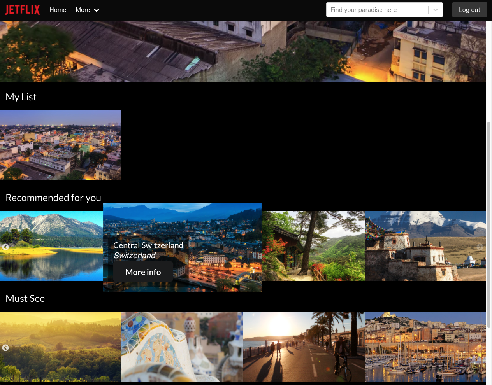
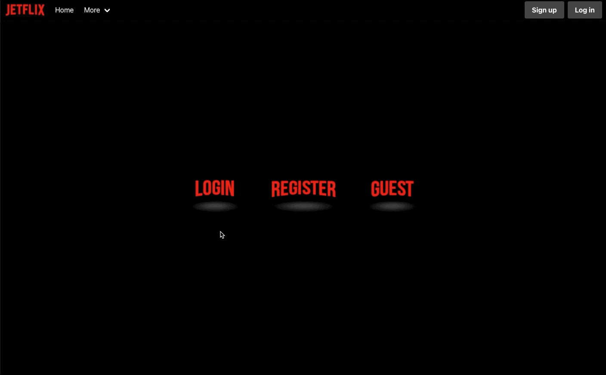

# General Assembly Project Three - Jetflix
 
### Timeframe
8 days
 
### Group Members:
- Andrew Oglivy: https://github.com/aoglivy10
- Jacqueline de Leeuw: https://github.com/jacquelinedeleeuw
- Justine Solano: https://github.com/justinesolano
- Oliver Lewis: https://github.com/olilewis1
 
## Project Overview
Jetlix is a Netflix inspired project with a social aspect based on Instagram. The aim of the app is to help users explore destinations from the database for a future holiday. The destinations in the database are a combination of the most popular cities and regions to visit. The app allows users to create a profile and favourite destinations, view more information about these and create their own social profile where they can upload pictures of their own holidays. The users can then interact with other users and like or comment on other users’ holiday pictures.
 
### Deployed version
https://jetflixapp.herokuapp.com/
 
To explore the app, you can use the below login credentials:
- Email: admin@email.com
- Password: password
 

 
### Project Brief
- Build a full-stack application by making your own backend and your own frontend
- Use an Express API to serve your data from a Mongo database
- Consume your API with a separate frontend built with React
- Be a complete product which most likely means multiple relationships and CRUD functionality for at least a couple of models
- Implement thoughtful user stories/wireframes that are significant enough to help you know which features are core MVP and which you can cut
- Have a visually impressive design to kick your portfolio up a notch and have something to wow future clients & employers. ALLOW time for this.
- Be deployed online so it’s publicly accessible.
 
### Technologies used:
#### Frontend:
- React
- Axios
- Semantic UI
- Bulma
- SASS
- HTTP-Proxy-Middleware
- React Router DOM
 
#### Backend:
- Node
- MongoDB
- Mongoose
- Express
- Bcrypt
- Json web token
 
#### Development Tools:
- Git & Github
- VS Code
- Insomnia
- Yarn
- Cloudinary
- Google Chrome Dev tools
- Trello Board for planning
 
### Process
#### Day 1 - Planning
 
##### Concept
Our idea for Jetflix came together quickly as we all have a shared interest in travel and were missing going on holiday due to COVID-19. We wanted to take on the challenge of making a clone of an existing website and we picked Netflix because of its great user interface and browsing-based structure. When we decided we wanted to incorporate a social media aspect where users could interact Instagram felt like the best choice as many people use this platform already to share holiday pictures.
 

 
##### Day 1 - Wireframes & planning
We used my whiteboard to create a wireframe with all different pages and links between these. As we were working in a group of 4 for the first time and there were many different aspects to be worked on we decided to use Trello to organize the project into smaller chunks.
 
##### Day 2 - Backend
We created the backend using Mongoose as a group with Live Share on VS Code to ensure there was no confusion about any of the models and content. We decided to create 2 schemas, one for the destinations and one for the users.
 
We implemented an embedded `ratingSchema` in the `destinationSchema` so users could rate destinations and we could use the average rating to display.
The `userSchema` had an embedded `photoSchema` which included a `commentSchema` and `likesSchema`. The comment and like schemas were added so authenticated users could comment and like other users’ pictures.
 
After the models were set up, we created the routes for login, registration, ratings, user lists, comments and likes. This was fairly straightforward and we checked all routes in insomnia before adding the frontend.
 
##### Day 3 till 8 - Frontend
Once the frontend was connected we divided tasks and I started with the landing page. With the use of Semantic UI I created hover over buttons for login, registration and a guest path.
 

 
We wanted to work with Semantic UI framework for the navbar but realised the framework made it more difficult to quickly put this together. Justine was working on this but after it was put together using Semantic we decided Bulma would work better and I helped out by changing the framework to Bulma instead.
 
##### Homepage
Once the landing page was set up I started working on the homepage. Firstly the hero image and details. I used a `useEffect` with `Math.random` to ensure a random different destination would show each time the page was loaded.
```
useEffect(() => {
   const getHero = async () => {
     try {
       const { data } = await axios.get('/api/destinations')
       setHeroDestination(data)
       setHero(parseFloat(Math.floor(Math.random() * data.length)))
     } catch (err) {
       console.log(err)
     }
   }
   getHero()
 }, [])
```
 
##### Sliders
Next I worked on the sliders below the hero, I used `react-slick` for this. I created sliders for ‘My List’, ‘Recommended for you’, ‘Must See’ and ‘Trending Now’. I added CSS to create the picture popup effect Netflix has when you hover over an image. After adding in the sliders I needed to work on filtering the data from our backend API to show different destinations in each slider. I filtered the data for the ‘Must See’ slider to show all European destinations and then started working on ‘Recommended for you’.
 

 
For the ‘Recommended for you’ slider I needed to amend the registration page.
Oli and Andrew worked on the Login and Registration pages and after these were setup I added error handling to both as well as the search function on the Registration page with the use of `react-select`. The tags chosen when registering would be saved in an array in the user model and are used to display ‘Recommended for you’ on the homepage. We also improved the styling with a background image that Justine created in photoshop and I added Bulma framework for the styling.
 

 
Next was the ‘My List’ slider. I added a button to the text on the Hero information to add destinations to the array in the user model and update the page dynamically with the axios requests.
```
const handleMyList = async (event) => {
  const id = event.target.name
  const profileId = getPayloadFromToken().sub
  const myNewArray = myList
  try {
    myList.map(item => {
      if (item.id === event.target.name) {
        throw new Error
      }
    })
    const { data } = await axios.get(`/api/destinations/${id}`)
    myNewArray.push(data)
    setMyList({ ...myNewArray })
    await axios.post(`/api/profiles/${profileId}/myList`, data, {
      headers: {
        Authorization: `Bearer ${window.localStorage.getItem('token')}`
      }
    }, [])
  } catch (err) {
    console.log('Cannot add to My List')
    window.alert('Error! Cannot add to My List')
  }
}
```
 
##### Popup
For the ‘more info’ popup on the slider images and hero information I built my own popup with CSS z-index. I included more data from our destinations model in this popup as well as a button to add the destination to the users’ ‘My List’.
```
.home-detail-info {
  z-index: 10;
  color: white;
  position: absolute;
  display: block;
  top: 35px;
  left: 10vw;
  background-color: rgba(0, 0, 0, 0.8);
  h2 {
    color: white;
  }
  p {
    margin-top: 5px;
  }
  .home-detail-tags {
    width: 35vw;
  }
  .rating,
  .button {
    margin-top: 20px;
  }
```
 
##### Ratings & Searchbar
The next feature I worked on was ratings for the destinations. I used the Semantic UI `classNames` for this feature. When a user submits a rating, the number of stars is posted to the API and the stars shown on the page will change colour depending on the rating.
```
const handleRating = async (event) => {
  try {
    await axios.post(`/api/destinations/${event.target.id}/ratings`, { rating: event.target.tabIndex }, {
      headers: {
        Authorization: `Bearer ${window.localStorage.getItem('token')}`
      }
    })
    if (event.target.tabIndex > 0) setRating({ one: 'active icon', two: 'icon', three: 'icon', four: 'icon', five: 'icon' })
    if (event.target.tabIndex > 1) setRating({ one: 'active icon', two: 'active icon', three: 'icon', four: 'icon', five: 'icon' })
    if (event.target.tabIndex > 2) setRating({ one: 'active icon', two: 'active icon', three: 'active icon', four: 'icon', five: 'icon' })
    if (event.target.tabIndex > 3) setRating({ one: 'active icon', two: 'active icon', three: 'active icon', four: 'active icon', five: 'icon' })
    if (event.target.tabIndex > 4) setRating({ one: 'active icon', two: 'active icon', three: 'active icon', four: 'active icon', five: 'active icon' })
  } catch (err) {
    console.log(err)
    window.alert('You need to login to submit a rating')
  }
  if (event.target.id === allDestinations[hero].id) return
  setRating({
    one: 'icon',
    two: 'icon',
    three: 'icon',
    four: 'icon',
    five: 'icon'
  })
}
```
 
I added the search bar to the navbar and put in a conditional statement to only show it when the user is on the homepage. The search bar works with react-select, like the search bar on the registration page. The destinations shown on the homepage update dynamically when a user changes the input of the search bar inside the `useEffect()` to get the destination data.
```
let destinationsArray = []
      if (mySearchArray.length > 0) {
        destinationsArray = mySearchArray
      } else {
        destinationsArray = data
      }
```
 
 

 
##### Upload Picture
Lastly I created the page where the user can upload a picture for their Jetflix profile. This was a form similarly designed to the login and registration pages. For the image upload I used cloudinary. The image is posted to cloudinary via an axios post request and the url is stored on the user model so this can be shown on their profile page.

 
### Key learnings
The scope of our project was quite a challenge as we had many different aspects we wanted to incorporate but being able to divide tasks and help each other out made a big difference. This was also the first project working on a GitHub repository as a group which was a great learning curve. We didn’t experience too many issues with merging and working together on this which was a big win.
 
### Future improvements
- Improved styling on the profile side of the app
- Fully responsive design
- Ability to edit and delete comments and likes
- Likes and comments to appear without reloading the page
- Remove duplicates when using the search bar filter
